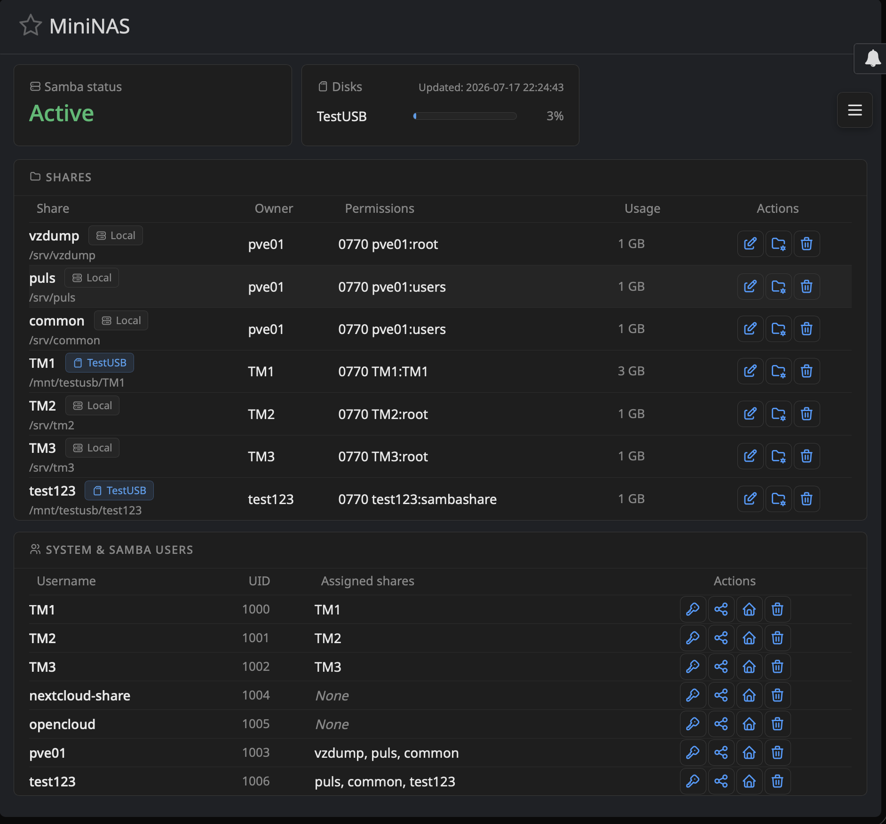

# MiniNAS

> ⚠️ **Development Project** — This module is under active development and not yet ready for production use. Features may change, break, or be incomplete. Use at your own risk.

A lightweight Webmin module for Linux file sharing administration.

Built on top of Samba, Linux and Webmin – without replacing any of them.



## Features
- Share management with hybrid editor (structured fields + raw Samba parameters)
- User provisioning workflow (OS user + Samba user + directory + permissions in one step)
- Permission management with visual checkbox matrix
- HDD-neutral status checks (no unnecessary disk wake-ups)
- Atomic smb.conf writes with testparm validation and rollback

## Requirements
- Webmin
- Samba
- Debian/Ubuntu Linux

## Installation
```bash
cd /usr/share/webmin
git clone https://github.com/jps-user/mininas.git mininas
chmod +x mininas/*.cgi
```
In the Webmin UI, click **"Refresh Modules"** (left sidebar) so Webmin picks up
the new module. MiniNAS then appears under **Servers → MiniNAS (Samba Admin)**
(set via `category=servers` in `module.info`).

If it shows up under "Un-used Modules" or the wrong category instead, Webmin's
module cache is the usual cause — a `Refresh Modules` click alone doesn't
always clear it. Force a full rebuild:
```bash
rm -f /var/webmin/module.infos.cache   # path may be /etc/webmin/ on older Webmin versions
systemctl restart webmin
```
Then hard-refresh the browser (`Ctrl+Shift+R` / `Cmd+Shift+R`). You can check
what Webmin actually loaded for a module with:
```bash
grep 'mininas' /var/webmin/module.infos.cache
```
Note: Webmin's category values are plural — `servers`, not `server` — and
don't match the category *names* shown in the UI 1:1. If you change
`category=` in `module.info`, verify the exact value against another
module's cache entry rather than guessing.

## Disk Setup for LXC Containers

MiniNAS can track usage and sleep state for extra disks (e.g. USB HDDs) beyond the
container's root filesystem. If you're running MiniNAS inside an unprivileged LXC
container (the common Proxmox setup), there's some host-side prep to do first —
skipping this leads to confusing "n/a" readings and permission errors that look like
MiniNAS bugs but are actually container/host plumbing.


### Why this is needed

Unprivileged LXC containers can't mount raw block devices themselves — `mount:
permission denied` even as root inside the container. The reliable pattern is:
**the Proxmox host mounts the disk, the container only receives the mounted
directory.** This means MiniNAS never sees a `/dev/sdX` device inside the
container for these disks — only a path. `disks.conf` (see below) is designed
around this: it accepts either a block device or a directory path.

### Step-by-step (host = Proxmox, container = your MiniNAS LXC)

**1. Identify the disk by UUID, not `/dev/sdX`**

Device names can shift between reboots or USB port changes. On the host:
```bash
blkid /dev/sdX1
```
Note the `UUID=...` value — use it everywhere below instead of the device name.

**2. Mount the disk on the host via `/etc/fstab`**

```
UUID=<your-uuid>  /mnt/<name>  ext4  defaults,noatime,nofail  0  2
```
`nofail` is important — without it, a missing/disconnected USB disk can hang the
host at boot.

**3. Pass the mount point into the container (not the raw device)**

Using Proxmox's own mount point feature keeps this simple and doesn't require any
special container privileges:
```bash
pct set <CTID> -mp0 /mnt/<name>,mp=/mnt/<name-in-container>
```
This appears as a plain directory inside the container — no block device, no
`mount` permissions needed inside the container.

**4. Fix ownership so the container can actually write to it**

This is the step that's easy to miss. Unprivileged containers remap their internal
UIDs to a high range on the host (commonly starting at 100000 — check
`/etc/subuid` on the host to confirm). The mount point you just created still
belongs to the host's real `root` (UID 0), which shows up as `nobody:nogroup`
inside the container — so even `mkdir` as container-root fails with "Permission
denied".

Fix, on the **host**:
```bash
chown <base-uid>:<base-gid> /mnt/<name>
```
(commonly `chown 100000:100000 /mnt/<name>` — confirm your actual base UID first).

This changes ownership of the mount point only, not existing files on the disk.
New files/directories the container creates underneath it will be owned
correctly from then on. This keeps the container fully unprivileged — no
security trade-off, unlike making the container privileged or opening up
`lxc.idmap`.

**5. Register the disk in MiniNAS**

Inside the container, go to **Manage Disks** and add the mount path (not a device
node) with a label:
```
/mnt/<name-in-container>:<Label>
```
MiniNAS auto-detects sleep state only for real block devices; for mount-path
disks it can't determine sleep state (there's no device to query) — so usage is
simply re-measured on every cache refresh. This is safe: reading a directory's
size can't wake a sleeping disk the way spinning up a block device would.

**6. Point a share at the disk**

In the share editor, the **Storage location** dropdown lists your configured
disks. Picking one auto-fills the path as `<disk mount>/<share name>`. If the
target directory doesn't exist yet, choose **"Create directory"** when saving.

### Common pitfalls

- **Using `lxc.mount.entry` to pass through a raw block device** — this looks
  like it should work (the device node appears inside the container) but
  `mount` on it still fails with permission denied in an unprivileged
  container. Use a Proxmox mount point (`mp0`) instead, as above.
- **Forgetting the UUID/ownership step** — the disk tile will just show "n/a"
  forever, and "Wake & measure disks" won't help, because the underlying `df`/`du`
  calls silently return nothing usable.
- **Nested paths** — shares living on a secondary disk naturally end up two
  levels deep (`/mnt/<disk>/<share>`), which earlier MiniNAS versions
  (before v0.9.1) rejected as invalid.

## Changelog

### Unreleased
- Fixed: `valid users` / `read list` lines with multiple space- or comma-separated names (e.g. hand-edited `smb.conf`) were parsed as one combined entry instead of separate users
- Fixed: several pages (delete/rename/password confirmation screens, home directory management) printed share names, usernames, or paths into HTML without escaping — a section or path containing HTML could have been rendered as markup instead of plain text
- AJAX endpoints (`testparm.cgi`, `update_cache.cgi`, `set_permissions.cgi`, `get_users_groups.cgi`) now build their JSON responses with `JSON::PP` instead of manual string concatenation

### v0.9.2
- **Path field on the share editor is now split**: a fixed prefix (the chosen storage location's mount point) plus a freely editable suffix, composed into the actual path on submit. Switching storage location swaps only the prefix and preserves whatever you typed as the suffix — previously the two could drift out of sync
- **Filesystem actions on path change replaced with three explicit options**, each with unambiguous, tested behavior on both the data and the old directory:
  - **Rename** — `mv`; old path stops existing
  - **Move data** — copies to the new path (via `rsync -a`), then deletes the old directory
  - **Copy data** — copies to the new path, old directory is left untouched
  - All three refuse to run if the target path already exists, to avoid silently merging or overwriting data
- **Code cleanup**: all inline `<script>` blocks with Perl-interpolated JavaScript (in `edit_section.cgi` and `edit_permissions.cgi`) moved into `ui_widgets.js` as plain functions; data now passed via `data-*` HTML attributes instead of being spliced into JS source strings. Fixes a broken path-reset regex that resulted from repeated escaping across Perl/JS boundaries
- Fixed: `module.info` used `category=others`, filing MiniNAS under a generic bucket instead of alongside other server-admin tools; now `category=servers`
- Added a "Disk Setup for LXC Containers" section to this README, covering UID mapping, Proxmox mount points vs. raw block device passthrough, and common pitfalls

### v0.9.1
- **Storage cache system**: disk and share usage tracked in `/var/lib/mininas/storage.cache`, refreshed after filesystem actions and via an explicit "Wake & measure disks" action — never wakes a sleeping disk just to read a value
- **Disk sleep detection**: `hdparm`-based, with a `/proc/diskstats` fallback for USB bridges that don't support `hdparm -C`
- **Mount-path disks**: disks reached via a Proxmox mount point (e.g. `mp0` passthrough into an LXC, no raw block device visible) are now fully supported alongside real block devices — usage is measured on every refresh since reading a directory can't wake a sleeping disk
- **Manage Disks page** (`manage_disks.cgi`): add/remove/relabel configured disks, with auto-detected block device and mount point candidates
- **Storage location** on the share editor: pick a configured disk and the path auto-fills as `<disk>/<share name>`
- **Disk badge** on the dashboard share table: shows which configured disk (or "Local") each share's path resolves to
- **Dashboard layout**: actions moved into a right-hand slide-out sidebar; disk tiles with usage bars and an "Updated: ..." timestamp replace the old share/user count tiles
- Fixed: path validation only allowed one path segment under `/mnt` or `/srv`, rejecting nested paths like `/mnt/<disk>/<share>`
- Fixed: "Create directory" on the share editor silently did nothing when the path field was left unchanged, even if the target directory didn't exist yet

## Philosophy
See [PHILOSOPHY.md](PHILOSOPHY.md)
